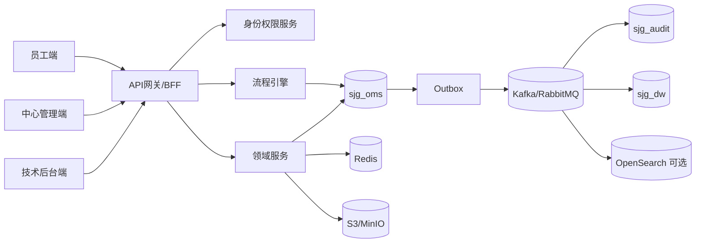

# 上金谷运营管理平台数据库总体架构 V1.0

## 1. 设计结论

本方案以 **PostgreSQL 16 + Redis + S3/MinIO + 消息总线** 为基础，采用“**三库、分Schema、统一流程内核、领域聚合根、明细分表、动态字段扩展、审计独立存储、分析库只读消费**”架构。

不采用“每个端口、每个表单一张物理表”的方式。原材料中三端共 2,164 份表单、90,124 条字段定义，若直接按表单建表会产生大量重复宽表、状态不一致和跨端数据复制。本方案将员工端、中心端、技术端视为同一业务事实的不同视图，三端共享同一领域主键、流程实例和审计链。

## 2. 规模与覆盖

| 指标 | 数量 |
|---|---|
| 流程数 | 126 |
| 三端流程记录 | 378 |
| 表单数 | 2164 |
| 原始字段行数 | 90124 |
| 唯一数据库字段 | 445 |
| 状态节点 | 3138 |
| 业务规则 | 4836 |
| 接口配置 | 2697 |
| 数据库数 | 3 |
| Schema数 | 46 |
| 物理表数 | 265 |
| 字段字典行数 | 7116 |
| 关系数 | 1335 |
| 索引数 | 1023 |

## 3. 逻辑拓扑

## 4. 三端一致性原则

1. 员工端、中心端、技术端不得各建一套业务表；三端通过权限、字段可见性和动作矩阵访问同一记录。
2. 业务主表只保存稳定事实；审批轨迹在 `workflow.wf_action_log`；动态表单值在 `workflow.wf_submission_value`；附件在 `document.attachment_link`。
3. 所有状态变化必须经过流程状态机，并在同一事务写业务表、流程动作日志和 `core.outbox_event`。
4. 跨中心黄金路径 P120—P126 使用 `workflow.wf_orchestration_instance` 连接子流程，不复制子单数据。
5. 审计库与分析库均禁止业务端直接修改；以Outbox/CDC消费为准。

## 5. 事务边界

- 单一领域聚合：本地ACID事务。
- 跨Schema但同库查询：允许只读JOIN；写入必须由所属领域服务执行。
- 跨数据库/外部系统：Outbox + 消费幂等 + Saga补偿。
- 金额、库存、积分、票务核销采用不可变流水；纠错通过冲销记录，不覆盖历史。
